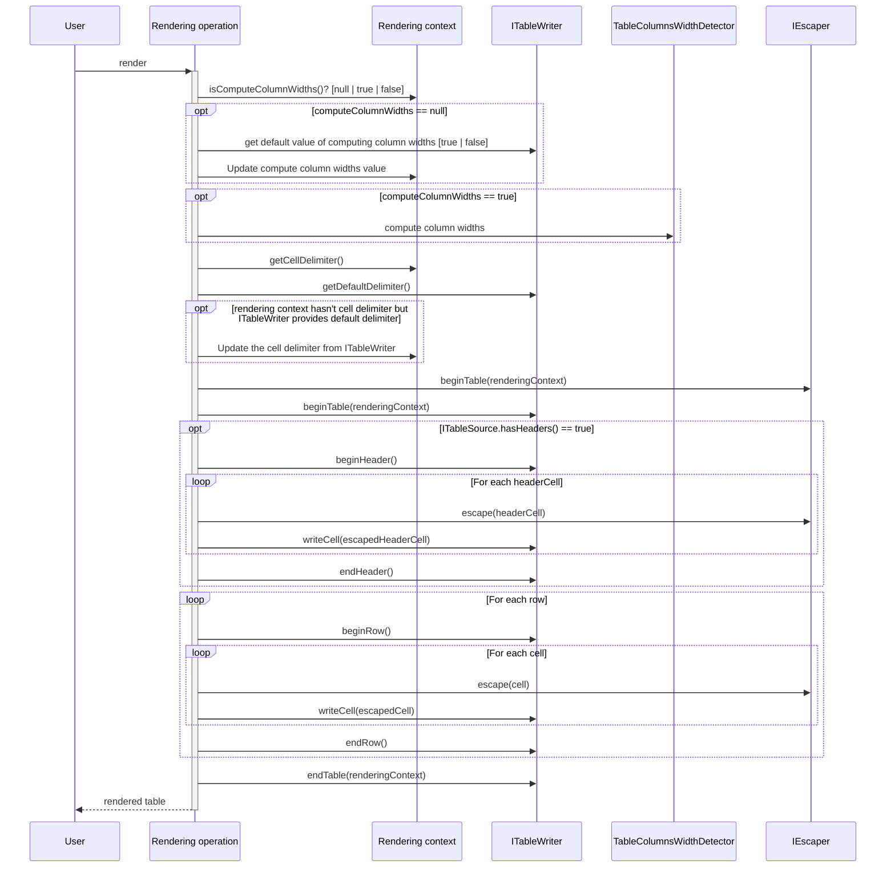

# mjaron-etudes-java

Standalone library for printing Java object lists (arrays, iterables) as a Markdown, CSV or HTML formatted table.  
Utils compatible with Java 1.8.

[](https://search.maven.org/artifact/io.github.mjfryc/mjaron-etudes-java/)
[](https://github.com/mjfryc/mjaron-etudes-java/actions/workflows/gradle.yml)
[](https://github.com/mjfryc/mjaron-etudes-java/actions/workflows/gradle-publish.yml)


## Table generation utils

### Short example

```gradle
implementation 'io.github.mjfryc:mjaron-etudes-java:0.3.0'
```

```
Table.render(persons, Person.class).run();
```

| name  | surname  | birthday                      | address | contact                     |
|-------|----------|-------------------------------|---------|-----------------------------|
| Sally | Fox      | Mon Mar 25 00:00:00 CET 3872  | London  | sally@sallymfox.com         |
| Jay   | Elephant | Mon Mar 20 00:00:00 CET 3820  | Paris   | jay.elephant@protonmail.com |
| Bella | Tran     | Sun Apr 12 00:00:00 CEST 3863 | China   | tran@bella.com              |

### Verbose example

Let's assume following Person class:

```java
package pl.mjaron.etudes.sample;

import java.util.Date;

@SuppressWarnings("unused")
public class Person {
    private final String name;
    private final String surname;
    private final Date birthday;
    private final String address;
    private final String contact;

    public Person(String name, String surname, Date birthday, String address, String contact) {
        this.name = name;
        this.surname = surname;
        this.birthday = birthday;
        this.address = address;
        this.contact = contact;
    }

    public String getName() {
        return name;
    }

    public String getSurname() {
        return surname;
    }

    public Date getBirthday() {
        return birthday;
    }

    public String getAddress() {
        return address;
    }

    public String getContact() {
        return contact;
    }

    public static Person[] getSampleData() {
        return new Person[]{
                new Person("Sally", "Fox", new Date(1972, 2, 25), "London", "sally@sallymfox.com"),
                new Person("Jay", "Elephant", new Date(1920, 2, 20), "Paris", "jay.elephant@protonmail.com"),
                new Person("Bella", "Tran", new Date(1963, 3, 12), "China", "tran@bella.com")
        };
    }
}

```

Then following code will render the table:

```java
package pl.mjaron.etudes.sample;

import pl.mjaron.etudes.Table;
import pl.mjaron.etudes.table.VerticalAlign;

public class PersonVerboseSample {
    public static void run() {
        // Verbose options demo
        Table.render(Person.getSampleData(), Person.class)

                // By default, the Markdown table format without escaper is used.
                // Calling .markdown() causes using Markdown renderer and Markdown escaper.
                .markdown() // Use Markdown renderer and escaper.
                // or
                // .csv() // Use CSV renderer and CSV escaper.
                // or
                // .html() // Use HTML renderer and HTML escaper.

                // Skip escaping the special characters.
                .withEscaper(null)

                // Optionally force align / do not align column widths.
                .withAlignedColumnWidths()
                // or
                //.withoutAlignedColumnWidths()
                // or
                //.withEqualColumnWidths()

                // Optionally use the custom cell delimiter.
                // ',' is the default cell delimiter.
                .withCellDelimiter(',')

                // How the lines will be separated.
                .withLineBreakCRLF()
                // or '\n'
                // .withLineBreakLF()
                // or '\r'
                // .withLineBreakCR()

                // How align the text (Left, Right or Center)
                .withAlign(VerticalAlign.Left)
                // or
                // .withAlign(VerticalAlign.Right)
                // or
                // .withAlign(VerticalAlign.Center)
                // or
                // .withAlign(null) // Use the default align.

                // Where to save the table.
                .toFile("build/sample.csv")
                // By default, the System.out is used, which can be specified as:
                // .to(System.out)
                // or: .to(Stream|PrintStream|Appendable|File|StringBuilder out)

                // Run the render operation.
                .run()
        // or
        // .runToString() // to create the String with whole table.
        ;
    }
}

```

### Markdown customization

Following example shows the Markdown customization options.

```java
package pl.mjaron.etudes.sample;

import pl.mjaron.etudes.Table;
import pl.mjaron.etudes.table.VerticalAlign;

import static pl.mjaron.etudes.table.RenderContext.col;

public class MarkdownCustomizationSample {
    public static void customizeAlignment() {
        Table.render(Person.getSampleData(), Person.class).markdown().withAlign(VerticalAlign.Right).withAlign(1, VerticalAlign.Left).run();
    }

    public static void customizeColumnsOrder() {
        Table.render(Person.getSampleData(), Person.class).markdown().withColumns(
                // @formatter:off Preferences > Editor > Code Style > Formatter Control
                 col("contact", "CONTACT")
                .col("address")
                .col("surname").as("SURNAME")
                // @formatter:on
        ).run();
    }
}

```

#### Column alignment

There is possibility to set the all columns alignment and particular columns alignment. Column indexes are counted from 0.

|  name | surname  |                      birthday | address |                             contact |
|------:|:---------|------------------------------:|--------:|------------------------------------:|
| Sally | Fox      |  Mon Mar 25 00:00:00 CET 3872 |  London |             sally@sallymfox&#46;com |
|   Jay | Elephant |  Mon Mar 20 00:00:00 CET 3820 |   Paris | jay&#46;elephant@protonmail&#46;com |
| Bella | Tran     | Sun Apr 12 00:00:00 CEST 3863 |   China |                  tran@bella&#46;com |

#### Column names and order

There is possibility to filter the columns, customize column names and order.

| CONTACT                             | address | SURNAME  |
|-------------------------------------|---------|----------|
| sally@sallymfox&#46;com             | London  | Fox      |
| jay&#46;elephant@protonmail&#46;com | Paris   | Elephant |
| tran@bella&#46;com                  | China   | Tran     |

### CSV customization

Below sample CSV snippet. Custom value separator may be set. Columns may be aligned but it is not recommended when importing by spreadsheet programs.

```java
package pl.mjaron.etudes.sample;

import pl.mjaron.etudes.Table;

import static pl.mjaron.etudes.table.RenderContext.col;

public class CsvCustomizationSample {
    public static void run() {
        Table.render(Person.getSampleData(), Person.class).csv()
                .withCellDelimiter(" , ")    // Allows changing the cell separator; ',' is by default.

                // Column alignment used here only to make it more human-readable.
                // Column alignment is not recommended for CSV due to importing it later by spreadsheet applications.
                // Additional spaces for alignment may break the cell content.
                // E.g. Use "Trim spaces" option when importing with LibreOffice Calc.
                .withAlignedColumnWidths()

                // Let's select the rendered columns.
                .withColumns(
                // @formatter:off Preferences > Editor > Code Style > Formatter Control
                col("contact", "CONTACT")
                        .col("address")
                        .col("surname").as("SURNAME")
                // @formatter:on
        ).run();
    }
}

```

```csv
CONTACT                     , address , SURNAME 
sally@sallymfox.com         , London  , Fox     
jay.elephant@protonmail.com , Paris   , Elephant
tran@bella.com              , China   , Tran    

```

### HTML customization

Basic HTML table may be rendered. When the align is specified, it is written as inline style attribute.

There is possibility to set the table id and class HTML attributes, so it can be customized with CSS.

```java
package pl.mjaron.etudes.sample;

import pl.mjaron.etudes.Table;
import pl.mjaron.etudes.table.VerticalAlign;

import static pl.mjaron.etudes.table.Html.tableId;
import static pl.mjaron.etudes.table.RenderContext.col;

public class HtmlCustomizationSample {
    public static void run() {
        // @formatter:off Preferences > Editor > Code Style > Formatter Control
        Table.render(Person.getSampleData(), Person.class)
                .html(tableId("my-table-id").tableClass("my-table-class"))
                .withAlign(VerticalAlign.Center)
                .withAlign(1, VerticalAlign.Right)

                // Let's select the rendered columns.
                .withColumns(
                        col("contact", "CONTACT")
                        .col("address")
                        .col("surname").as("SURNAME")
        ).run();
        // @formatter:on
    }
}

```

```html
<table id="my-table-id" class="my-table-class">
    <tr>
        <th style="text-align: center;">CONTACT</th>
        <th style="text-align: right;">address</th>
        <th style="text-align: center;">SURNAME</th>
    </tr>
    <tr>
        <td style="text-align: center;">sally@sallymfox.com</td>
        <td style="text-align: right;">London</td>
        <td style="text-align: center;">Fox</td>
    </tr>
    <tr>
        <td style="text-align: center;">jay.elephant@protonmail.com</td>
        <td style="text-align: right;">Paris</td>
        <td style="text-align: center;">Elephant</td>
    </tr>
    <tr>
        <td style="text-align: center;">tran@bella.com</td>
        <td style="text-align: right;">China</td>
        <td style="text-align: center;">Tran</td>
    </tr>
</table>

```


### Table generation sequence

The table is generated in the following sequence:



## Object utils

### Getting object values

```
{topSpeed=35.24, legsCount=4, lazy=true, name=John}
```

```java
class Sample {
    void test() {
        Cat cat = new Cat();
        Map<String, Object> values = Obj.getFieldValues(cat);
        System.out.println(values);
    }
}
```

## Array utils

### Joining arrays, adding elements

```java
class Sample {
    void test() {
        int[] a = new int[]{1, 2, 3};
        int[] b = new int[]{6, 7, 5};
        int[] c = Arr.add(a, b);
        assertArrayEquals(c, new int[]{1, 2, 3, 6, 7, 5});
    }
}
```

## Pair implementation

```java
class Sample {
    void test() {
        Pair<Integer, String> pair = new Pair<>(5, "C");
        assertEquals(5, pair.getKey());
        assertEquals("C", pair.getValue());
    }
}
```

## Resource (file) path utils

### Get extension(without a dot)

```java
class Sample {
    void test() {
        assertEquals("txt", Path.extension("/my/path/to/file.txt"));
        assertEquals("", Path.extension("/my/path/to/file"));
        assertEquals("", Path.extension("/my/path/to/file."));
    }
}
```

## String utils

```java
class Sample {
    void test() {
        assertEquals(2, Str.charsCount("commit", 'm'));
        assertEquals("String", Str.capitalize("string"));
        assertEquals("  3", Str.padLeft("3", 3));
        assertEquals("3  ", Str.padRight("3", 3));
    }
}
```

## Time utils

```java
class Sample {
    void test() {
        Timer t = new Timer();
        doLongOperation();
        System.out.println("Passed time: " + t.getMillis() + " milliseconds.");
    }
}
```

## How to integrate with Gradle

### From Maven Central

<https://search.maven.org/artifact/io.github.mjfryc/mjaron-etudes-java/0.3.0/jar>

```gradle
implementation 'io.github.mjfryc:mjaron-etudes-java:0.3.0'
```

### As local `jar` file

* Download the latest release
    * From [here](https://github.com/mjfryc/mjaron-etudes-java/releases)
    * To `[gradle's root directory]/libs/`
    * E.g: `my-project/libs/mjaron-etudes-java-0.3.0.jar`
* In any Gradle subproject which needs this library, put following content:
    * `implementation files(project.rootDir.absolutePath + '/libs/mjaron-etudes-java-0.3.0.jar')`
* Now import package and use it, e.g:
    * `import pl.mjaron.etudes.*;`

