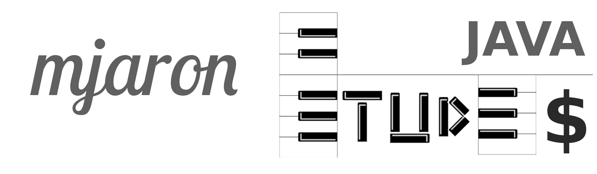
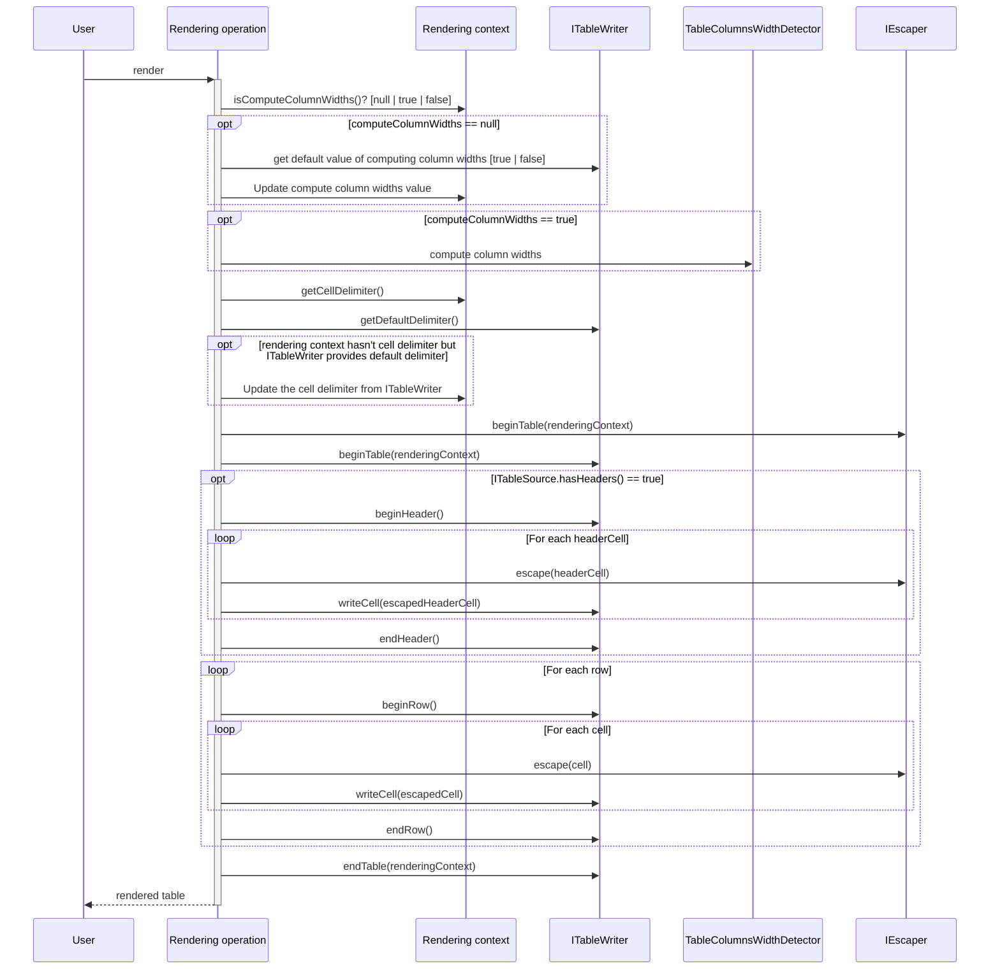

# mjaron-etudes-java

Standalone library for printing Java object lists (arrays, iterables) as a Markdown, CSV or HTML formatted table.  
Utils compatible with Java 1.8.

[](https://search.maven.org/artifact/io.github.mjfryc/mjaron-etudes-java/)
[](https://github.com/mjfryc/mjaron-etudes-java/actions/workflows/gradle.yml)
[](https://github.com/mjfryc/mjaron-etudes-java/actions/workflows/gradle-publish.yml)



## Table generation utils

### Short example

```gradle
implementation 'io.github.mjfryc:mjaron-etudes-java:0.2.1'
```

```ignorelang
Table.render(myCatsArray, Cat.class).markdown().run();
```

```ignorelang
| name | legsCount | lazy  | topSpeed |
|------|-----------|-------|----------|
| John | 4         | true  | 35.24    |
| Bob  | 5         | false | 75.0     |
```

### Verbose example of printing java iterables as Markdown / CSV / HTML table

```java
// Sample class.
// When generating the table, each instance of this class will be converted to single row.
class Cat {
    String name = "Tom";
    int age = 2;

    Cat() {
    }

    Cat(String name, int age) {
        this.name = name;
        this.age = age;
    }
}

class Sample {
    void test() {

        // Sample array or iterable of Java objects.
        final Cat[] cats = new Cat[]{new Cat(), new Cat("_Michael_", 5)};

        // It will print the Markdown table to the System.out.
        Table.render(cats, Cat.class).run();

        // Or
        final String catsTableString = Table.render(cats, Cat.class).runString();
        System.out.println(catsTableString);

        // Verbose options demo
        Table.render(cats, Cat.class)

                .markdown() // Use Markdown renderer and escaper (option used by default).
                // or
                // .csv() // Use CSV renderer and CSV escaper.
                // or
                // .html() // Use HTML renderer and HTML escaper.
                
                // Skip escaping the special characters.
                .withEscaper(null)
                
                // Optionally force align / do not align column widths.
                .withAlignedColumnWidths(false)
                // or
                // .withAlignedColumnWidths(true)

                // Optionally use the custom cell delimiter.
                // ',' is the default cell delimiter.
                .withCellDelimiter(',')

                // How the lines will be separated.
                .withLineBreakCRLF()
                // or '\n'
                // .withLineBreakLF()
                // or '\r'
                // .withLineBreakCR()

                // How align the text (Left, Right or Center)
                .withAlign(VerticalAlign.Left)
                // or
                // .withAlign(VerticalAlign.Right)
                // or
                // .withAlign(VerticalAlign.Center)
                // or
                // .withAlign(null) // Use the default align.

                // Where to save the table.
                .toFile("build/sample.csv")
                // By default, the System.out is used, which can be specified as:
                // .to(System.out)
                // or: .to(Stream|PrintStream|Appendable|File|StringBuilder out)

                // Run the render operation.
                .run()
                // or
                // .runToString() // to create the String with whole table.
        ;
    }
}
```

Sample generated table:

```
| name | legsCount |  lazy | topSpeed |
| ---- | --------- | ----- | -------- |
| John |         4 |  true |    35.24 |
|  Bob |         5 | false |     75.0 |
```

### Table generation customization

#### Markdown customization

Following code creates Markdown table with center vertical align and with escaping the special characters.

```java
class Sample {
    void test() {
        Table.render(cats, Cat.class).withMarkdownEscaper()
                .withAlign(VerticalAlign.Center)    // General table align
                .withAlign(1, VerticalAlign.Right)  // Particular column align.
                .run();
    }
}
```

So now all special characters are escaped by HTML number syntax, there is following raw text:

    |       name        | age |
    |:-----------------:|----:|
    |        Tom        |   2 |
    | &#95;Michael&#95; |   5 |

Rendered by Markdown as:

|       name        | age |
|:-----------------:|----:|
|        Tom        |   2 |
| &#95;Michael&#95; |   5 |

Without a `MarkdownEscaper`, cells will be rendered 'as is', so user is responsible for correct cell values:

```java
class Sample {
    void test() {
        Table.render(cats, Cat.class).withoutEscaper().run();
    }
}
```

    | name      | age |
    |-----------|-----|
    | Tom       | 2   |
    | _Michael_ | 5   |

| name      | age |
|-----------|-----|
| Tom       | 2   |
| _Michael_ | 5   |

#### Markdown custom escaper - @TODO

`@todo`Implement escaper which escapes only when preceded by (eg.) backslash `&#92;`.

### CSV

Below code configures the rendering with the CSV renderer and CSV special characters' escaper:

```java
class Sample {
    void test() {
        Table.render(cats, Cat.class).csv().run();
    }
}
```

```csv
name,age
Tom,2
_Michael_,5
```

### HTML

Below code configures the rendering with the HTML renderer and HTML special characters' escaper:

```java
class Sample {
    void test() {
        Table.render(cats, Cat.class).html().withAlign(VerticalAlign.Right).run();
    }
}
```

```html

<table>
    <tr>
        <th style="text-align: right;">name</th>
        <th style="text-align: right;">age</th>
    </tr>
    <tr>
        <td style="text-align: right;">Tom</td>
        <td style="text-align: right;">2</td>
    </tr>
    <tr>
        <td style="text-align: right;">_Michael_</td>
        <td style="text-align: right;">5</td>
    </tr>
</table>
```

## Object utils

### Getting object values

```
{topSpeed=35.24, legsCount=4, lazy=true, name=John}
```

```java
class Sample {
    void test() {
        Cat cat = new Cat();
        Map<String, Object> values = Obj.getFieldValues(cat);
        System.out.println(values);
    }
}
```

### Table generation sequence

The table is generated in the following sequence:



## Array utils

### Joining arrays, adding elements

```java
class Sample {
    void test() {
        int[] a = new int[]{1, 2, 3};
        int[] b = new int[]{6, 7, 5};
        int[] c = Arr.add(a, b);
        assertArrayEquals(c, new int[]{1, 2, 3, 6, 7, 5});
    }
}
```

## Pair implementation

```java
class Sample {
    void test() {
        Pair<Integer, String> pair = new Pair<>(5, "C");
        assertEquals(5, pair.getKey());
        assertEquals("C", pair.getValue());
    }
}
```

## Resource (file) path utils

### Get extension(without a dot)

```java
class Sample {
    void test() {
        assertEquals("txt", Path.extension("/my/path/to/file.txt"));
        assertEquals("", Path.extension("/my/path/to/file"));
        assertEquals("", Path.extension("/my/path/to/file."));
    }
}
```

## String utils

```java
class Sample {
    void test() {
        assertEquals(2, Str.charsCount("commit", 'm'));
        assertEquals("String", Str.capitalize("string"));
        assertEquals("  3", Str.padLeft("3", 3));
        assertEquals("3  ", Str.padRight("3", 3));
    }
}
```

## Time utils

```java
class Sample {
    void test() {
        Timer t = new Timer();
        doLongOperation();
        System.out.println("Passed time: " + t.getMillis() + " milliseconds.");
    }
}
```

## How to integrate with Gradle

### From Maven Central

<https://search.maven.org/artifact/io.github.mjfryc/mjaron-etudes-java/0.2.1/jar>

```gradle
implementation 'io.github.mjfryc:mjaron-etudes-java:0.2.1'
```

### As local `jar` file

* Download the latest release
    * From [here](https://github.com/mjfryc/mjaron-etudes-java/releases)
    * To `[gradle's root directory]/libs/`
    * E.g: `my-project/libs/mjaron-etudes-java-0.2.1.jar`
* In any Gradle subproject which needs this library, put following content:
    * `implementation files(project.rootDir.absolutePath + '/libs/mjaron-etudes-java-0.2.1.jar')`
* Now import package and use it, e.g:
    * `import pl.mjaron.etudes.*;`

